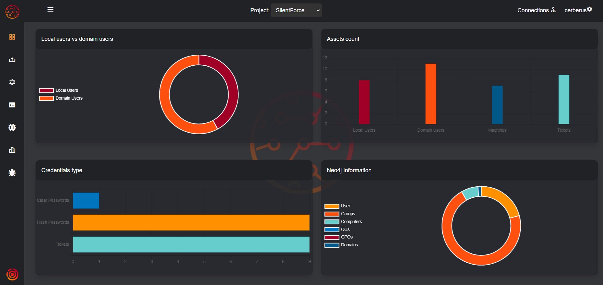
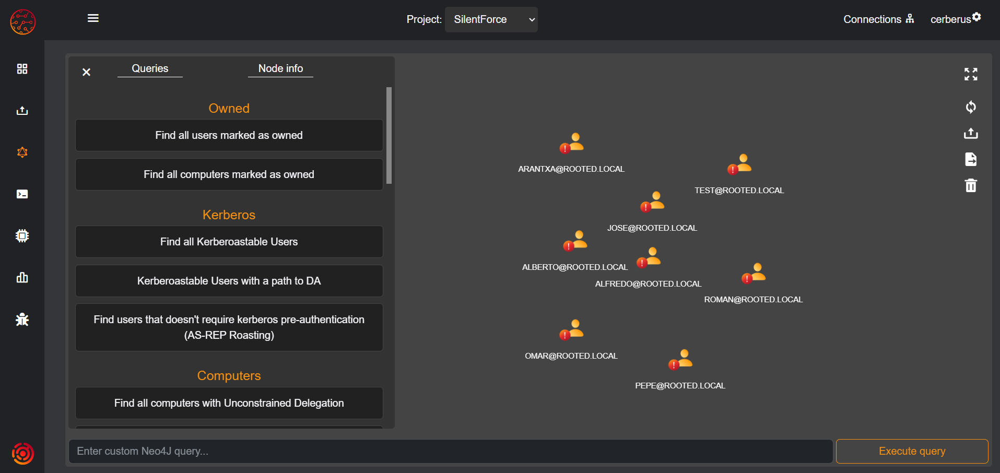

<picture>
  <source media="(prefers-color-scheme: dark)" srcset="cerberus/static/img/readme_img/logo_with_text_light.png">
  <source media="(prefers-color-scheme: light)" srcset="cerberus/static/img/readme_img/logo_with_text_dark.png">
  
</picture>

# Cerberus
Cerberus is a tool designed to simplify the process of internal intrusion, allowing to prioritize the most relevant assets and additionally works as a storage of information from security tools such as Mimikatz or secretsdump, allowing to have all the information continuously updated. With Cerberus, users can collect all data extracted from these tools and store it in a centralized database for easy access and analysis.

Using Cerberus makes it possible to collect and analyze valuable information efficiently and effectively, integrating all the information extracted from the different computers in an infrastructure into one database.

## Features
- Collect data from Mimikatz sekurlsa::logonpasswords.
- Collect data from Mimikatz lsadump::sam.
- Collect data from Mimikatz sekurlsa::tickets.
- Collect data from Impacket secretsdump.
- Ingest domain information from a dump generated by ADExplorer in neo4j database.
- Creation of separate Neo4j databases for each project.
- Upload and save tickets (both in kirbi and ccache formats).
- Craft silver and golden tickets from credentials.
- Add credentials to the database.
- Synchronization of the collected data with a neo4j database, allowing to automatically mark compromised users.
- Graph section, allowing to visualize relevant domain information.
- Import of nmap output from the network, allowing to prioritize the next steps of the intrusion.
- Upload the dns resolution information of the provided scripts



# Modules
## Ingest

This section shows the different modules implemented in the tool to ingest data and an example of the commands that can be used to collect the information in a correct format.


The following actions can be performed from this module:
- **Ticket import:** Allows the uploading of tickets in ccache and kirbi formats.
- **Import of results from external tools:** Allows the uploading of the results obtained from the Mimikatz and Impacket tools, allowing the uploading of the outputs of the commands listed below.
- **Dump import from an Active Directory:** To ingest domain information, you need to provide a dump created with ADExplorer or the corresponding JSON files. For this you need to have a neo4j instance, where the information will be stored.
- **Import of nmap scans:** Analyzes the result of a network scan performed with nmap, marking the computers with which it has visibility, to later visualize these computers in the graph section, prioritizing the following actions in the intrusion. It is necessary that the output format of the nmap is in XML.

The following are examples of how to obtain the outputs
### Mimikatz

#### sekurlsa::logonpasswords
```powershell
mimikatz.exe "privilege::debug" "log <output_file>" "sekurlsa::logonpasswords" exit
```
#### lsadump::sam
```powershell
mimikatz.exe "privilege::debug" "token::elevate" "log <output_file>" "lsadump::sam" exit
```
#### sekurlsa::tickets
```powershell
mimikatz.exe "privilege::debug" "log <output_file>" "sekurlsa::tickets /export" exit
```

### Impacket
#### secretsdump
```bash
impacket-secretsdump <domain>/<user>:<password>@<ip>
```

### NMAP
```bash
nmap <net> <options> -oX <output_file>
```

## Graph
This feature allows you to graphically visualize the various assets of a domain along with important information to carry out an attack more effectively.



The following actions can be performed from this module:
- **Use of queries:** Query relevant data using a predefined list of queries.
- **Use of custom queries:** Query relevant data using costomized queries.
- **Display of node information:** It allows the visualization of the information of the elements of the domain.
- **Data synchronization:** Button to synchronize the data saved in Cerberus with the data in neo4j.
- **Export of equipment list:** Allows you to export a list of all the computers in the domain, which can be used to perform a dns resolution and obtain which computers resolve, adding them to cerberus.
- **Domain dump import:** As in the Importer section, it allows you to upload a domain dump.
- **Clean database:** Allows you to delete data from the neo4j database.

Each time a new project is created, from the menu at the top right, you can manage the different neo4j databases, starting, stopping or deleting them.


This functionality is currently under development, which means that there may be limitations, bugs or missing features.

## Command generation
This section serves as a cheat sheet for various actions performed during a penetration test, enabling the automatic generation of commands based on the data imported into Cerberus.


## Technologies
In the Technologies section, we can view all the information ingested by the nmap-scanner and web-app-scanner agents. On this page, you will find details such as:

1.	Information on web technologies, including the URL of the page, vendor, and their versions, such as WordPress, Bootstrap, etc.
2.	Exposed services on the servers, where we can see details such as the machine’s IP, open port, running service, and the version and vendor of the service.

This data ingestion is handled by the scripts mentioned earlier. To run them, it is mandatory to specify the project they belong to, and Cerberus manages and organizes them for later visualization. When executing each script, the details of its functionality and required parameters are displayed.


## Data
The purpose of this section is to visualize all the data obtained. The different available subsections and their functionalities are described below:


### Machines
This subsection shows the information obtained from the domain's computers, and also has the functionality to upload a file with the results of using the DNSResolver script, located in the project's scripts folder. This script will be in charge of resolving the provided assets, returning the results in the format required for this functionality.
### Passwords
This subsection shows all the credentials obtained, as well as the option of adding a password manually or importing the result of launching hashcat, updating the credentials obtained with the stored hashes.
### Tickets
It allows the visualization of the different stored tickets, allowing you to download them in ccache and kirbi formats, or copy their information in base64. Additionally, it allows you to create silver and golden tickets from keys.
### Local / Domain Users
These subsections allow the display of the collected users.

## Vulnerabilities
In the Vulnerabilities section, we can see a summary of the technologies found with vulnerable versions and their corresponding CVEs. This information is cross-referenced with the NIST database and displayed in Cerberus, according to the product version. On this page, vulnerable web technologies such as WordPress, PHP, and others will be shown separately from the active services within a machine, such as vulnerabilities in FTP, SSH, Apache, etc.


## Scripts
In the project scripts folder, you can find the different external scripts. Currently, there are DNSResolver scripts in Python, Bash, and PowerShell. Additionally, the scripts for the nmap-scanner and web-app-scanner agents are also available, responsible for identifying vulnerabilities in technologies and ingesting them into the Cerberus Dashboard.

## Installation

1. Navigate to the project folder:
```bash
cd /path/to/project/Cerberus
```

2. Grant execution permissions to the cerberus.sh file:
```bash
chmod +x cerberus.sh
```

3. Run the script with superuser privileges:
```bash
sudo ./cerberus.sh --install
```
This command will create a default admin user with the username "cerberus" and the password "cerberus". If you'd like to specify a custom username and password for the admin, you can use the following code instead:
```bash
sudo ./cerberus.sh --install -U admin_user -P admin_pass
```

## Usage
Quick run

```bash
sudo ./cerberus.sh --run
```
With this code the web server will start on localhost at port 5000 by default.
If you want to specify the net and port you can use the parameters --host/-h and --port/-p.

```bash
sudo ./cerberus.sh --run -h 0.0.0.0 -p 1234
```

If the application is going to be exposed on the network, it is recommended to change the SECRET_KEY of the application, located in instance/config.py

## Limitations
- When a large file is uploaded, the application will load while ingesting the information, but this does not mean that the application has crashed.
- When launching a new instance of the Neo4j database, you need to wait until the Docker instance has completed its configuration before using it.