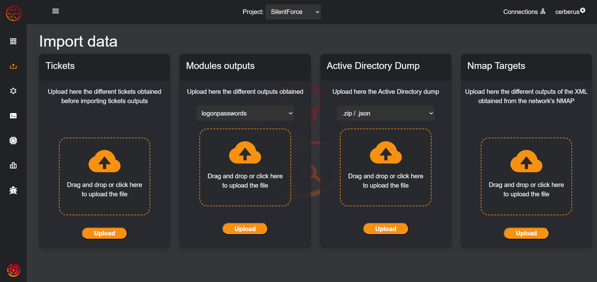
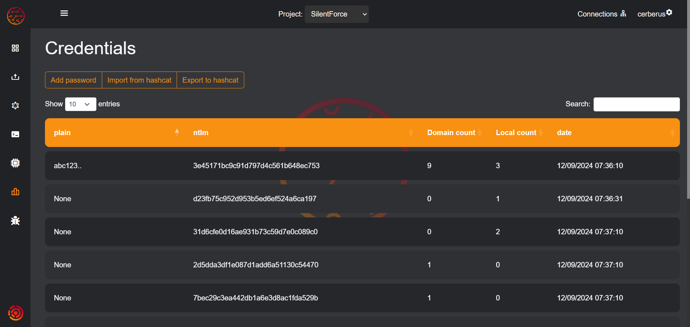

# Cerberus
Cerberus is a tool designed to simplify the process of internal intrusion, allowing to prioritize the most relevant assets and additionally works as a storage of information from security tools such as Mimikatz or secretsdump, allowing to have all the information continuously updated. With Cerberus, users can collect all data extracted from these tools and store it in a centralized database for easy access and analysis.

Using Cerberus makes it possible to collect and analyze valuable information efficiently and effectively, integrating all the information extracted from the different computers in an infrastructure into one database.

## Features
- Collect data from Mimikatz sekurlsa::logonpasswords.
- Collect data from Mimikatz lsadump::sam.
- Collect data from Mimikatz sekurlsa::tickets.
- Collect data from Impacket secretsdump.
- Ingest domain information from a dump generated by ADExplorer in neo4j database.
- Upload and save tickets (both in kirbi and ccache formats).
- Craft silver and golden tickets from credentials.
- Add credentials to the database.
- Synchronization of the collected data with a neo4j database, allowing to automatically mark compromised users.
- Graph section, allowing to visualize relevant domain information.
- Import of nmap output from the network, allowing to prioritize the next steps of the intrusion.
- Upload the dns resolution information of the provided scripts.
- Craft most commonly used commands.


# Modules
## Ingest

This section shows the different modules implemented in the tool to ingest data and an example of the commands that can be used to collect the information in a correct format.


The following actions can be performed from this module:
- **Ticket import:** Allows the uploading of tickets in ccache and kirbi formats.
- **Import of results from external tools:** Allows the uploading of the results obtained from the Mimikatz and Impacket tools, allowing the uploading of the outputs of the commands listed below.
- **Dump import from an Active Directory:** To ingest domain information, you need to provide a dump created with ADExplorer or the corresponding JSON files. For this you need to have a neo4j instance, where the information will be stored.
- **Import of nmap scans:** Analyzes the result of a network scan performed with nmap, marking the computers with which it has visibility, to later visualize these computers in the graph section, prioritizing the following actions in the intrusion. It is necessary that the output format of the nmap is in XML.

The following are examples of how to obtain the outputs
### Mimikatz

#### sekurlsa::logonpasswords
```powershell
mimikatz.exe "privilege::debug" "log <output_file>" "sekurlsa::logonpasswords" exit
```
#### lsadump::sam
```powershell
mimikatz.exe "privilege::debug" "token::elevate" "log <output_file>" "lsadump::sam" exit
```
#### sekurlsa::tickets
```powershell
mimikatz.exe "privilege::debug" "log <output_file>" "sekurlsa::tickets /export" exit
```

### Impacket
#### secretsdump
```bash
impacket-secretsdump <domain>/<user>:<password>@<ip>
```

### NMAP
```bash
nmap <net> <options> -oX <output_file>
```

## Graph
This feature allows you to graphically visualize the various assets of a domain along with important information to carry out an attack more effectively.


The following actions can be performed from this module:
- **Use of queries:** Query relevant data using a predefined list of queries.
- **Display of node information:** It allows the visualization of the information of the elements of the domain.
- **Data synchronization:** Button to synchronize the data saved in Cerberus with the data in neo4j.
- **Export of equipment list:** Allows you to export a list of all the computers in the domain, which can be used to perform a dns resolution and obtain which computers resolve, adding them to cerberus.
- **Domain dump import:** As in the Importer section, it allows you to upload a domain dump.

This functionality is currently under development, which means that there may be limitations, bugs or missing features.

## Data
The purpose of this section is to visualize all the data obtained. The different available subsections and their functionalities are described below:



### Machines
This subsection shows the information obtained from the domain's computers, and also has the functionality to upload a file with the results of using the DNSResolver script, located in the project's scripts folder. This script will be in charge of resolving the provided assets, returning the results in the format required for this functionality.
### Credentials
This subsection shows all the credentials obtained, as well as the option of adding a password manually or importing the result of launching hashcat, updating the credentials obtained with the stored hashes.
### Tickets
It allows the visualization of the different stored tickets, allowing you to download them in ccache and kirbi formats, or copy their information in base64. Additionally, it allows you to create silver and golden tickets from keys.
### Local / Domain Users
These subsections allow the display of the collected users.

## Commands

This section allows you to craft the most used commands in Impacket, Mimikatz and Rubeus.


## Scripts
In the project scripts folder you can find the different external scripts. Currently there are DNSResolver scripts, both in python, bash and powershell.

## Quickstart

Use of a virtual environment is recommended
### Creating and Activating a Python Virtual Environment

A virtual environment is a self-contained Python environment that allows you to install and manage packages separately from your system-wide Python installation. It helps keep your project dependencies organized and isolated.
In order to create virtual environments it is necessary to install python3.11-venv with the following command:
```bash
apt install python3.11-venv
```
Once installed, you can create the virtual environment following these steps

#### Step 1: Create a virtual environment
To create a virtual environment, navigate to the directory where you want to create it and run the following command:

```shell
python3 -m venv myenv
```
#### Step 2: Activate the virtual environment

```shell
source myenv/bin/activate
```

Now that your virtual environment is active you can proceed to install the project dependencies.

## Installation

```bash
git clone https://github.com/SilentForceOfficial/Cerberus.git
cd Cerberus
pip install -r requirements.txt
```
Once the dependencies have been installed, it is recommended to deactivate and reactivate the virtual environment to avoid errors related to these dependencies.

```bash
deactivate
source myenv/bin/activate
```
To initialize the bbdd, execute the following command, indicating the user name and password to access the application.
If no username and password are specified, the default will be "cerberus".

```bash
flask --app cerberus setup
```

If you want to specify a different username or password, you can indicate it as follows.
```bash
flask --app cerberus setup --user cerberus --password cerberus
```

If you want to use the graph module, you must have neo4j installed.
```bash
apt install neo4j
```

## Usage

```bash
flask --app cerberus run
```
The web server will start on localhost at port 5000 by default.

To allow access to the application from the network or modify the default port, use the parameters "host" and "port".

```bash
flask --app cerberus run --host 0.0.0.0 --port 1234
```

If the application is going to be exposed on the network, it is recommended to change the SECRET_KEY of the application, located in instance/config.py

## Limitations
- When a large file is uploaded, the application will load while ingesting the information, but this does not mean that the application has crashed.
- Neo4j only allows to have one database with the free version, so the connection to the neo4j database is independent to the different databases of the tool.